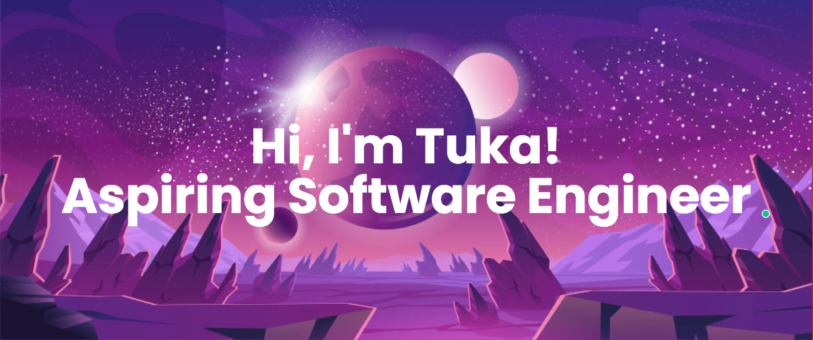

<!-- 

 -->
<!-- <h1 align="center">Hi there, I'm <a href="https://github.com/alartuka" target="_blank" rel="noreferrer">Tuka</a> 👋</h1> -->
<!-- <h3 align="center">I'm a Student, Developer 💻, Photographer 📸, Designer 🎨, and Woman in STEM!</h3>  -->

I'm a Mathematics-Computer Science student at the University of Waterloo with a plan to minor in Cognitive Science focusing on artificial intelligence.

I love the entire process of developing creative websites and I love learning about the psychology behind people's behaviours, thoughts, and emotions to develop and design better applications and to soon be able to use the knowledge to bring emotional quotient to technology. 

Seeking Summer 2022 internships in software engineering or web development. 

### 🤝 Connect with me:

  
<a href="mailto:talarbi@uwaterloo.ca?subject=Reaching out from Github" align="left">📫</i></a>

 💬 If you have any feedback, collaboration inquiries, or want to discuss any opportunies, please do not hesitate to reach out!
 

## 🛠️ Languages and Tools

 
 

## 🔭 I'm currently working on

- Recipe book App (React)
<!-- - My "Citizen-ize" app (Working on it soon...) + (prototype link in my LinkedIn) -->
- My personal website and portfolio (React)
- My python skills
 

## 🌱 I'm currently learning

- React js
- C programming language
 

## 🏆 My Github stats
<!--  -->

<!--
**alartuka/alartuka** is a ✨ _special_ ✨ repository because its `README.md` (this file) appears on your GitHub profile.

Here are some ideas to get you started:

- 🔭 I’m currently working on ...
- 🌱 I’m currently learning ...
- 👯 I’m looking to collaborate on ...
- 🤔 I’m looking for help with ...
- 💬 Ask me about ...
- 📫 How to reach me: ...
- 😄 Pronouns: ...
- ⚡ Fun fact: ...
-->
