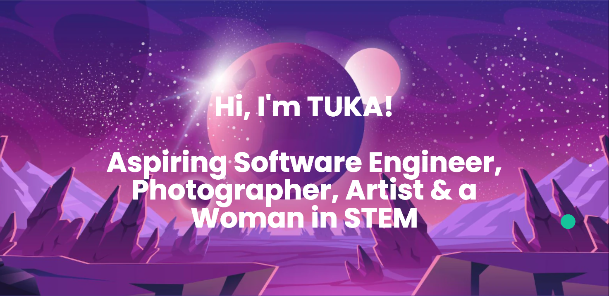

<!-- 

 -->
<!-- <h1 align="center">Hi there, I'm <a href="https://github.com/alartuka" target="_blank" rel="noreferrer">Tuka</a> 👋</h1> -->
<!-- <h3 align="center">I'm a Student, Developer 💻, Photographer 📸, Designer 🎨, and Woman in STEM!</h3>  -->

<!--  -->

I'm a 💻Computer Science & Mathematics student at the University of Waterloo🎓 focusing on artificial intelligence🤖.

I love the entire process of developing creative websites and I love learning about the psychology behind people's behaviours, thoughts, and emotions to develop and design better applications and to soon be able to use the knowledge to bring emotional quotient to technology. 

&nbsp;
<!-- &nbsp; --> 
<!--           -->

<a href="mailto:talarbi@uwaterloo.ca?subject=Reaching out from Github">
<!--           -->
<!--                    -->

</a>
 
 

## 🛠️ &nbsp;Languages and Tools

	

 
 

## 🔭&nbsp; I'm currently working on

- My personal website and portfolio (React)
- My python skills
 

## 🌱 &nbsp;I'm currently learning

- Data Structures, Types & Management
- Computer Systems(Organization & Design) & Sequential Programs
- Natural Language Processing 
 

## 📈 &nbsp;My Github stats

 

<!-- ============================================================================================= -->
<!--
**alartuka/alartuka** is a ✨ _special_ ✨ repository because its `README.md` (this file) appears on your GitHub profile.

Here are some ideas to get you started:

- 🔭 I’m currently working on ...
- 🌱 I’m currently learning ...
- 👯 I’m looking to collaborate on ...
- 🤔 I’m looking for help with ...
- 💬 Ask me about ...
- 📫 How to reach me: ...
- 😄 Pronouns: ...
- ⚡ Fun fact: ...
-->
